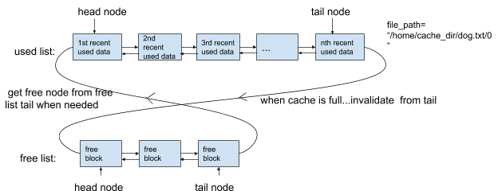
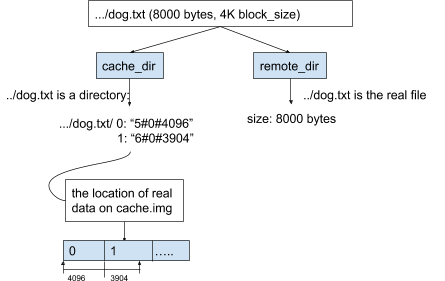
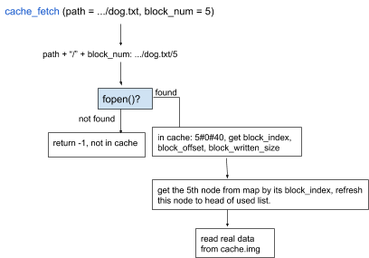
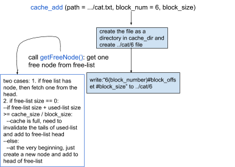

# s3-storage-tiering
## 1. Introduction

It is very common to utilize remote network filesystem for data storage as an effective, scalable, low-cost storage solution. Based on that, we built a software named RAT-FS to provide a large local disk cache for a remote network filesystem.

Business scenario: considering you have a network filesystem, such as SSH or NFS or CIFS or S3FS (mount an S3 bucket via FUSE) mounted share, and the connection to that share is rather slow. Locally, you have a sizable amount of disk space to spare, but not enough to make a complete local copy of the remote share. Then what you can do is to apply our RAT-FS, a filesystem that act between the local disk space and the remote network filesystem, to substantially speed up data access and reduce network traffic. 

When data is requested, RAT-FS first checks its local cache. If the requested data is not there, it fetches the requested data over the network and stores them in the cache. This continues until the cache is full, then the cache invalidate the least recently accessed data. Therefore, the most frequently used data will be in the local cache and won't need to be fetched from the network, but the whole share is still available.

## 2. Design

2.1 Overall architecture: 

2.3 Local Cache Directory: 

The cache is implemented as an in-memory LRU cache with two major data structures: a hashmap and a pair of doubly-linked lists working as a free list and a used list. The head of the used list is the node which was most recently accessed for reading. The tail is the least recently accessed, and the next one node for deletion. The node of those two doubly-linked lists has the location information of one single data block on cache.img, a local disk image for storing the most recently used data, allocated before running RAT-FS.

Inside cache_dir, there are different sub directories which have the same names as the remote store directory. For example, file /dog.txt in the remote directory is a directory /dog.txt in the local cache directory, which contains numbers range from 0 to ( cache.img size / block_size). Each number contains the on-disk cache.img information of that block of data. The format of is #<block_number on disk image>#<offset>#<size>.

2.2 Read, Write, Update, Remove: 

RAT-FS overwrites a couple of system calls such as getattr, read, write, readdir, opendir, etc using FUSE and pass them through to the remote network filesystem specified as the remote storage. Magic happens in the read and write functions where RAT-FS interacts with local cache directory and the mounted remote network filesystem. In RAT-FS, every file is seen by the user in mount_dir. The local cache is a write-through cache and data to read is cached. Writing data as well as creating a new file happens in the remote network filesystem. Whenever user “cat” a file, if the file name isn’t found in the cache directory, data will be fetched from the remote directory. Since the data now becomes most recently used, it will be stored on cache.img. To update a file, the first thing to do is to check whether the file is in cache_dir, if so, it should be invalidated and free the blocks of that file. Next, the new content of this file is written to the remote directory and the corresponding node in local cache is removed, then the next time user read that updated data, it will get the updated data from remote and add it to cache. 

2.5 RAT-FS Set-up: 

To use RAT-FS, there are a few steps before running the program. First, figure out how much free disk space available locally and df -h command should help. Then run dd if=/dev/zero of=cache.img bs=<cache.img size> count=1 and make a filesystem to hold the cache by doing mkfs.ext2 -m 0 -F cache.img. After mounting the remote network filesystem, you should be ready to go. To run RAT-FS, use ./fuse <cache_dir> <remote_dir> <mount_dir> <cache_size> <block_size>. Notice that the directory name cannot end with a slash ‘/’ and cache_size&block_size is measured by bytes.

## 3. Implementation

3.1 Overall implementation:

RAT-FS is implemented in C & C++ and applied FUSE (filesystem in userspace) program to provide efficient storage solutions for NFS server. Based on the design architecture, implementation of RAT-FS is divided into two major parts -- fuse.c and cache.cc(.hh). fuse.c implements the filesystem working as a bridge between local cache and remote storage. cache.cc implements cache operations that are related to reading/writing cache.img and stores the on-disk layout of most recently used data in the cache_dir.

3.2 Fuse Implementation:

RAT-FS filesystem overwrites a bunch of linux system calls using FUSE. Some of them are very simple since there are not a lot of modifications.  Major modification happens on getattr, read, write, create, unlink.

3.2.1 Read & Write: 
-- int rat_read(const char *path, char *buf, size_t size, off_t offset, struct fuse_file_info *fi)
-- int rat_write(const char *path, const char *buf, size_t size, off_t offset, struct fuse_file_info *fi)

First thing to do in read/write is to calculate the first_block(which block to start reading/writing), last_block(where block to end reading/writing) and the block offset of both (block_offset in between is always 0). 

rat_read and rat_write implementation:

3.3 Cache Implementation:

In general, it is a LRU cache of a pair of doubly-linked lists working as a free list and a used list. Major functions are cache_fetch() and cache_add().

3.3.1 cache_fetch():
--int cache_fetch(const char* path, uint32_t block_num, uint64_t offset,  char* buf, uint64_t len,ssize_t *bytes_read)

3.3.2 cache_add():
-- int cache_add(const char* path, uint32_t block_num, const char* buf, uint64_t len,ssize_t* bread): 

## 4. Performance Analysis of RAT-FS

1. s3fs - object store access via file abstraction

We tested RAT-FS with remote_dir being a s3fs mounted share, where the ip address is in Singapore. s3fs is a solution for object store access via file abstraction, though the performance suffers from the impact of the network latency and of the object gateway overhead. Network read performance is affected by the capabilities of the client’s NIC, the object storage read (HTTP GET) operation throughput, and the number of concurrent GET connections issued to the object storage. The object gateway overhead includes the overhead imposed by the FUSE calls, the overhead for data structures, etc. 

2. RAT-FS functionality and performance study result:

First of all, we have tested basic functionalities of RAT-FS. It works as a real filesystem that lets users to perform normal filesystem commands such as “cd”, “ls”, “cat”, “rm”. Also, it supports users to update files through editors such as vim and emacs. Subsequently, the goal of RAT-FS is to provide a large local disk cache for a remote network filesystem. File IO for remote network filesystem is relatively slow because of network latency. RAT-FS will significantly improve the read performance of the remote storage by cutting down the network latency and caches the most recently used data locally. In addition, as block_size is defined by user, an inappropriate block_size might cause performance loss. Overall, RAT-FS still suffers from the overhead imposed by the FUSE calls, the overhead for data structures (unordered_map and double linked list), and the overhead for cache implementation.

3 Benchmark: IOzone -- Generate a mix of load with a specific pattern

we apply IOzone as our testing tool. IOzone is a filesystem benchmark tool. The benchmark generates and measures a variety of file operations. The benchmark tests file I/O performance for the following operations: Read, write, re-read, re-write, read backwards, read strided, fread, fwrite, random read/write, pread/pwrite variants, aio_read, aio_write, mmap. In our scenario, we will mainly focus on sequential I/O performance of initial write, re-write, read, re-read and random read/write. Generally, during each test, iozone will create a dummy file of a particular size. We conducted different tests with different file size and observe the variance of the performance.

Performance Evaluation (Results forms are in appendix)

4.1 sequential: fixed block_size = 8K, cache_size differs, file_size = 5M

First, s3fs itself has an in-memory stat cache that helps the read and reread performance. We disabled the s3fs stat cache, and reread throughput is still slightly larger than read throughput when local disk cache size is zero. We think its because s3fs inside also caches HTTP requests and the expire time is non-zero. Second, since in this test, file size in iozone benchmark is 5M, which is a small file. As the local disk cache size increases, reread performance improves significantly (around 10 times larger). If cache size is way larger than the actual file size, local disk cache never gets full. For each sequential reread, it will hit the local disk cache (cache hit ratio 100%). Third, we tested the s3fs mounted share with the stat cache disabled and compared with our result. The result is roughly the same as when local disk cache size is 0. 

4.2 sequential(Kbytes/sec): fixed block_size = 8K, cache_size = 50M, file_size differs

We fixed the local disk cache size to 50M and observe the performance with different test file size. As we discussed above, If we choose a very small file and the cache never becomes full, the performance will improve a lot because of the 100% cache hit ratio for reread. In real case, whenever the local disk cache is full, our LRU cache will invalidate some nodes of used list and add those nodes to the free list for the next upcoming data. 

We can also notice that when the cache size is too small, reread performance could get even worse. For example, when file size is 100MB and the local disk cache is 50MB, after first sequential read of the whole file, only last 50 MB data of this file would be stored in the cache. Then we start second sequential read of the file, since we start with first 50MB data read, all cache fetch would be missed. In this case, cache hit ratio is 0 and each block of the file is added to cache then kicked out. Therefore, reread performance does not improve and get even worse, because each reread will kick out one node from cache. As file size decreases, we can observe notable improvement on reread because of the increasing cache hit ratio.

4.3 sequential(Kbytes/sec): fixed cache_size = 50M, block_size differs, file_size = 5M

What we observe here is the influence of different block size on read/reread performance. Generally, a larger block size is often beneficial for large sequential read and write workloads. A smaller block size is likely to offer better performance for small file, small random read and write, and metadata-intensive workloads. We also notice that inside FUSE implementation, if read size gets too big, it will crash because of “read too many bytes” error, and 32K block size test failed because of that reason. That’s why we tested block size of 4K, 8K, 16K. Since local disk cache is 50MB, it’s large enough for the 5M file. A larger block size means fewer block cached and fewer disk seek time. Also, for larger block size, more data can be read in one time, and the average overhead caused by FUSE and cache implementation is lowered. Therefore, as the block size increases, the reread performance improves.

4.4 random(Kbytes/sec): fixed cache_size = 50M, file_size = 5M, block_size differs

We can see that the random read performance is relatively low compared to the sequential read. For random pattern IO, read offset is randomly set and disk head is actually seeking random locations on disk. Therefore, cache hit ratio is also random and could be very low.

5 Code analysis with callgrind

In this code analysis test, we focus on finding heavy-cost functions and figure out how to optimize them. We use callgrind as a profiler to measure the cost of each function called. In order to get a fair result, we need large file IOs, so we run the callgrind with iozone testing. We got this result during iozone sequential write, rewrite, read, reread performance testing. Here we classify cost to self cost and inclusive cost. As functions can call each other, it makes sense to distinguish the cost of the function itself ('Self Cost') and the cost including all called functions ('Inclusive Cost'). 'Self' is sometimes also referred to as 'Exclusive' costs. 

From the graph below, we can see iozone fork three processes to do write, read and delete file operations. The deletion of file would call function rat_unlink(), it took 5.75% of the total cost, which is not that significant.

5.1 rat_write  

The rat_write() itself only took 3.08% (inclusive cost) of the total cost. Since the local cache is a write through cache and not many operations need to be performed inside the write function. It is reasonable to be that small cost. Also rm_file_from_cache() took 2.44%(inclusive cost) to remove invalid files from local cache.

5.2 rat_read

For rat_read(), it took 32.53% (inclusive cost) of total cost. When we dive deep into rat_read(), we can see unordered_map took 2.19% (self cost) + 8.35% (self cost) in cache_fetch() and cache_add(). We use unordered_map to optimize cached data access time from O(n) to constant time. However, without this hash map, we need to traversal all data in the local disk cache for searching. So it is what we should pay for.  

5.3 vfprintf()

Now, we come to the big one. The function vfprintf() took 40% (inclusive cost) of the total cost, it was called 10681 times during the test. 

vfprintf() is mostly called in the whole project, and the second one is _IO_default_xsputn. Both two functions are used to read from/write to file stream or buffer. In our architecture, the local cache directory contains many small files that indicate the data location information on disk. These small files need to be read and written frequently,  which brings in larger disk seek time as well. Therefore, optimizing the structure of local cache directory would improve the performance. 

## What's Next?
1. Enable stat cache for file attributes.
2. Enable write back model for local cache.
3. Optimize cache structure: Replace all small files under cache_dir/ with one file, 32-bit integer for pairing between file_block_num and cache_img_block_num. This optimization expected to optimize with less disk seek and less stream and buffer read&write.  
